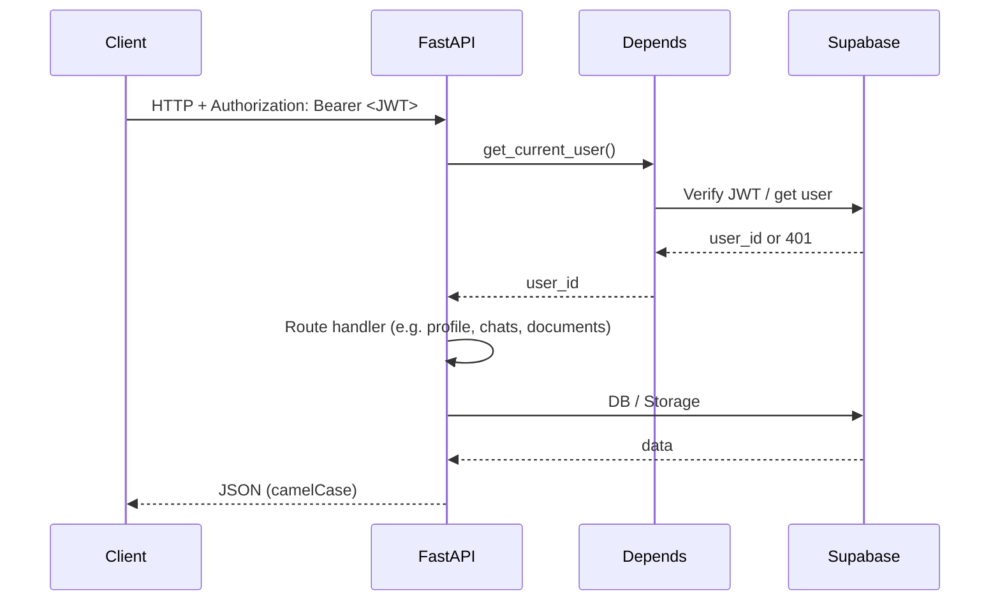
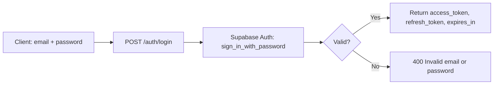
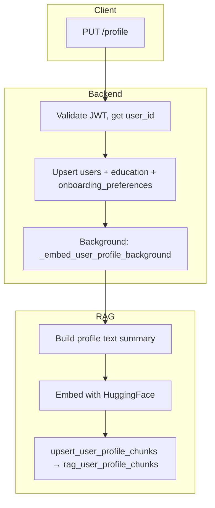
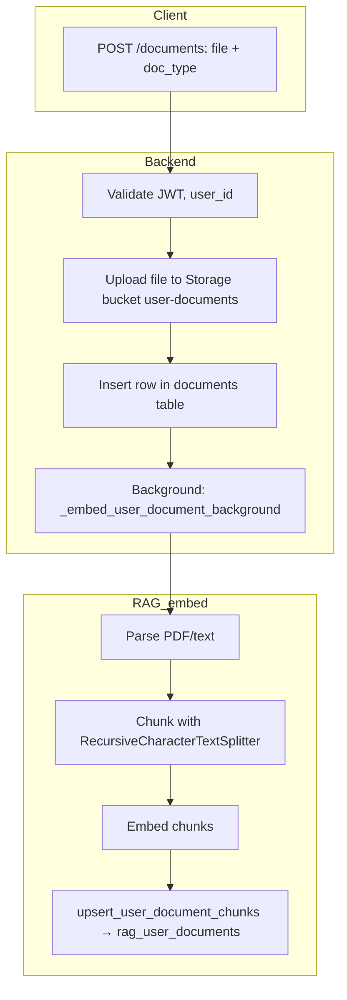
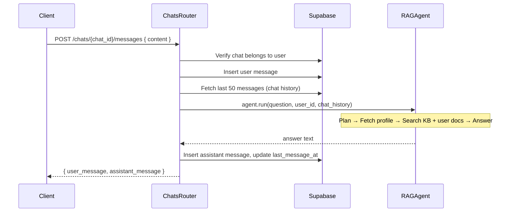
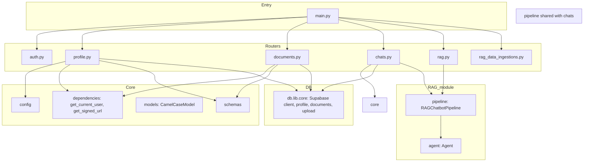

# Teduco Backend — Overview & Workflow

**Product presentation reference.**  
FastAPI backend: auth, profile, documents, chats, RAG initialization, and health.

---

## 1. Overview

The backend is the single entry point for all business logic. The frontend does **not** talk to Supabase directly (except for auth tokens); all data and AI flows go through FastAPI.

### High-level architecture

```
┌─────────────────────────────────────────────────────────────────────────┐
│                           BACKEND (FastAPI :8000)                        │
├─────────────────────────────────────────────────────────────────────────┤
│  Routers                                                                 │
│  ┌──────────┐ ┌──────────┐ ┌────────────┐ ┌───────┐ ┌─────┐ ┌──────────┐ │
│  │ /auth    │ │ /profile │ │ /documents │ │ /chats│ │/rag │ │/rag_data │ │
│  │ login    │ │ CRUD     │ │ upload     │ │ CRUD  │ │chat │ │ ingest   │ │
│  │          │ │ profile  │ │ delete     │ │ msgs  │ │     │ │          │ │
│  └────┬─────┘ └────┬─────┘ └─────┬──────┘ └───┬───┘ └──┬──┘ └────┬─────┘ │
│       │            │             │            │        │         │       │
│       └────────────┴─────────────┴────────────┴────────┴─────────┘       │
│                                    │                                     │
│  Core: config, dependencies (auth), models (CamelCase), schemas           │
│  DB:   Supabase client (PostgreSQL + Storage)                            │
│  RAG:  Pipeline + Agent (see README-RAG-CHATBOT.md)                      │
└────────────────────────────────────┬────────────────────────────────────┘
                                     │
                                     ▼
                    ┌────────────────────────────────┐
                    │  Supabase (PostgreSQL + Auth +  │
                    │  Storage, RAG vector tables)     │
                    └────────────────────────────────┘
```

### Main units

| Unit | Purpose |
|------|--------|
| **Auth** | `POST /auth/login` — sign in with email/password, returns JWT (access + refresh). |
| **Profile** | `GET/PUT /profile`, `GET/PATCH /settings` — user profile, education (high-school / university), onboarding preferences; triggers profile embedding for RAG. |
| **Documents** | `GET /documents`, `POST /documents`, `DELETE /documents/{id}` — list, upload (with background chunking/embedding), delete user documents. |
| **Chats** | `GET/POST /chats`, `GET/PUT/DELETE /chats/{id}`, `GET/POST /chats/{id}/messages` — conversations and messages; sending a message invokes RAG Agent. |
| **RAG** | `POST /chat` — standalone RAG endpoint (optional auth); initializes and exposes RAG pipeline. |
| **RAG Data** | Ingestion endpoints for university degree documents (crawl/ingest into vector store). |
| **Health** | `GET /health` — liveness and `rag_ready` status. |

---

## 2. Diagrams for non-technical audiences

*Use these when presenting to stakeholders, product owners, or non-developers.*

### What the “backend” is in plain terms

The **backend** is the part of Teduco that runs on a server. Whenever you use the app (log in, save your profile, upload a document, or send a chat message), your device talks to this server. The server checks who you are, loads or saves your data, and when you ask a question in chat, it finds the right information and generates an answer.

```
┌─────────────────┐         ┌─────────────────────────────────────────┐         ┌─────────────────┐
│  You (browser   │  ────►   │  Teduco server                           │  ────►   │  Your data      │
│  or app)        │  request │  • Checks your identity                  │  read/   │  (profile,       │
│                 │  ◄────   │  • Finds TUM program info                │  write   │   documents,     │
│                 │  answer  │  • Uses your profile & documents to      │          │   chats)        │
│                 │          │    personalize answers                  │          │                 │
└─────────────────┘          └─────────────────────────────────────────┘          └─────────────────┘
```

### What happens when you do something in the app

| You do this | Server does this | You get this |
|-------------|------------------|--------------|
| Log in | Checks your email and password, then remembers you for this session | Access to your dashboard |
| Save your profile (e.g. high school, GPA) | Stores your info and prepares it so the assistant can use it later | Updated profile; better answers later |
| Upload a document (transcript, CV) | Saves the file and prepares its content so the assistant can use it when you ask about yourself | Document in “Documents”; assistant can refer to it in chat |
| Send a message in chat | Saves your message, looks up TUM info and your profile/documents, then writes an answer | Your message + the assistant’s reply |

### One picture: from your action to your result

```
  YOU                    TEDUCO SERVER                      YOUR DATA & TUM INFO
   │                              │                                      │
   │  "What do I need to apply    │                                      │
   │   for Informatics Master?"  │                                      │
   │ ──────────────────────────► │  • Knows who you are                 │
   │                              │  • Looks up your profile & documents  │
   │                              │  • Looks up TUM program requirements │
   │                              │  • Writes an answer from that only   │
   │                              │ ◄────────────────────────────────────│
   │  "You need … (list).         │                                      │
   │   Based on your transcript   │                                      │
   │   you have …"                │                                      │
   │ ◄──────────────────────────  │                                      │
```

---

## 3. Detailed workflow diagrams (technical)

### 3.1 Request flow (any protected endpoint)



### 3.2 Auth login flow



### 3.3 Profile update and RAG profile embedding



### 3.4 Document upload and RAG document embedding



### 3.5 Send message (chat) and RAG response



### 3.6 Backend component dependency overview



---

## 4. File layout (reference)

```
backend/
├── src/
│   ├── main.py              # FastAPI app, CORS, router mount, set_rag_pipeline
│   ├── core/
│   │   ├── config.py        # Settings (Supabase, etc.)
│   │   ├── dependencies.py  # get_current_user, get_optional_current_user, get_signed_url
│   │   ├── models.py        # CamelCaseModel
│   │   └── schemas.py       # Response models (camelCase)
│   ├── db/
│   │   └── lib/
│   │       └── core.py      # Supabase client, get_user_profile, get_user_documents, upload_document, etc.
│   ├── routers/
│   │   ├── auth.py          # POST /auth/login
│   │   ├── profile.py       # GET/PUT /profile, GET/PATCH /settings
│   │   ├── documents.py     # GET/POST /documents, DELETE /documents/{id}
│   │   ├── chats.py         # Chats CRUD + POST message → RAG Agent
│   │   ├── rag.py           # POST /chat, RAG pipeline init
│   │   └── rag_data_ingestions.py
│   └── rag/                 # See README-RAG-CHATBOT.md
├── requirements.txt
└── dockerfile
```

---

## 5. Summary for presentation

- **Single API**: All app and RAG flows go through FastAPI.
- **Auth**: JWT from Supabase Auth; `get_current_user` on protected routes.
- **Profile & documents**: Stored in Supabase; document and profile updates trigger background RAG embeddings.
- **Chats**: Stored in Supabase; sending a message runs the RAG Agent (KB + user docs + profile) and saves the reply.
- **RAG**: Initialized at startup in `rag.py`; shared with `chats` for database-backed chats and exposed via `POST /chat` for standalone use.

For RAG internals (Agent, retrieval, prompts), see **README-RAG-CHATBOT.md**.  
For tables and RLS, see **README-SUPABASE-TABLES.md**.
