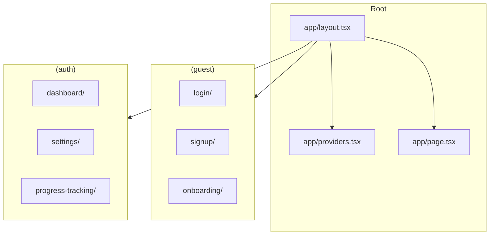
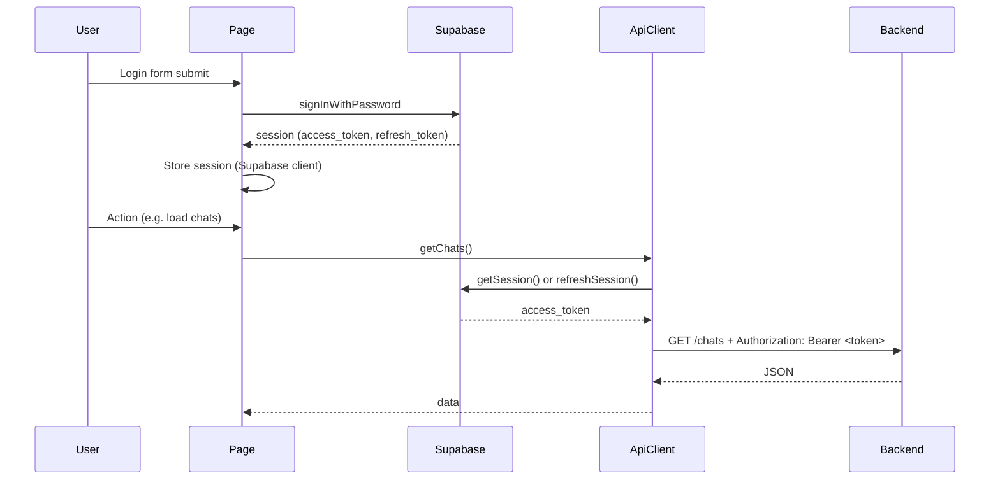
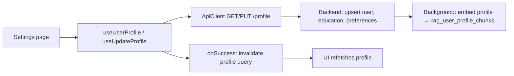
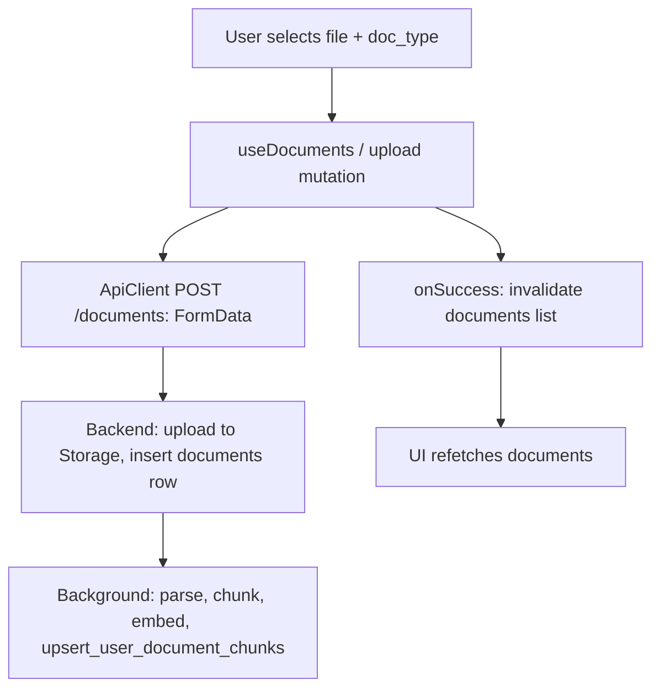

# Teduco Frontend — Overview & Workflow

**Product presentation reference.**  
Next.js app: auth, onboarding, dashboard (chat), settings, documents, progress; all server state via FastAPI.

---

## 1. Overview

The frontend is a **Next.js** application that:

- Uses **Supabase** only for **authentication** (session, JWT).
- Sends all other requests (profile, documents, chats, messages) to the **FastAPI backend** with the JWT in `Authorization`.
- Manages server state with **React Query** (TanStack Query); mutations invalidate caches and optionally use optimistic updates.

### High-level architecture

```
┌─────────────────────────────────────────────────────────────────────────────┐
│                        FRONTEND (Next.js :3000)                               │
├─────────────────────────────────────────────────────────────────────────────┤
│  App Router                                                                   │
│  (guest) login, signup, onboarding                                           │
│  (auth)  dashboard, settings, progress-tracking                              │
├─────────────────────────────────────────────────────────────────────────────┤
│  Data layer                                                                   │
│  • ApiClient (lib/api-client.ts) — base URL, auth headers, fetch, errors     │
│  • React Query — useQuery / useMutation, cache keys (chats, messages, etc.)  │
│  • Hooks (hooks/api/) — useChats, useMessages, useSendMessage, useUser, ...  │
├─────────────────────────────────────────────────────────────────────────────┤
│  UI                                                                           │
│  • Components (components/, components/ui/) — layout, chat, forms, sidebar    │
│  • shadcn/ui + Tailwind; theme provider                                       │
└─────────────────────────────────────────────────────────────────────────────┘
         │                                    │
         │ Auth only                           │ All other data
         ▼                                    ▼
   Supabase Auth                        FastAPI Backend
   (session, JWT)                       (profile, documents, chats, RAG)
```

### Main units

| Unit | Purpose |
|------|--------|
| **Guest** | Login, signup, onboarding (applicant type, education, preferences). |
| **Auth** | Protected layout; dashboard (chat UI), settings (profile), progress-tracking. |
| **Chat** | List chats, open/create chat, message list, send message (API + optional WebSocket streaming). |
| **Documents** | List documents, upload, delete (via API client). |
| **Profile / Settings** | View and edit profile, education, preferences (triggers backend profile embedding). |

---

## 2. Diagrams for non-technical audiences

*Use these when presenting to stakeholders, product owners, or non-developers.*

### What you see in the app (screens)

```
  BEFORE LOGIN                          AFTER LOGIN
  ─────────────                         ────────────

  • Login / Sign up                     • Dashboard (chat with the assistant)
  • Onboarding                          • Your chats (list, open, new)
    – Are you in high school              • Settings (name, education, goals)
      or at university?                   • Documents (upload transcript, CV, diploma)
    – School / program, GPA               • Progress (track your application)
    – Where do you want to study?
    – Which programs interest you?
```

### How you move through the app

```
  Start here                Then                      Main use
  ──────────                ────                      ────────

  Login or Sign up    ──►   Onboarding           ──►   Chat
       │                         │                        │
       │                         │                        ├── Ask about TUM programs
       │                         │                        ├── Ask "what do I need?"
       │                         │                        └── Get answers based on your
       │                         │                             profile and documents
       │                         │
       │                         └────────────────────►   Settings
       │                                                      (update profile anytime)
       │                                                 Documents
       │                                                      (add or remove files)
```

### What happens when you send a chat message

```
  YOU                                  APP & SERVER                           YOU SEE
  ───                                  ─────────────                          ──────

  Type a question                      App sends your message to the server
  and press Send    ──────────────►    Server looks up TUM info + your profile
       │                               and your documents
       │                               Server writes an answer (no guessing)
       │                               Server sends back your message + answer
       │                    ◄────────────
       │
       └────────────────────────────►  Your message appears
                                       Assistant’s reply appears below
                                       (Chat history is saved for next time)
```

### Your data stays in one place

Everything you enter (profile, documents, chat history) is stored securely and used only to personalize your experience. The app on your device only shows and sends your actions; the actual data lives on the server so you can use it from any device after logging in.

```
  Your device (phone, laptop)              Teduco servers
  ──────────────────────────              ──────────────
  • Shows login, chat, settings            • Store your profile
  • Sends what you type or upload          • Store your documents
  • Displays answers and your chats        • Store chat history
                                           • Use TUM program info to answer you
```

---

## 3. Detailed workflow diagrams (technical)

### 3.1 App route structure



### 3.2 Authentication and API request flow



### 3.3 Chat flow: open chat and send message

```mermaid
flowchart TB
    subgraph Dashboard
        A[URL ?chat=id or no chat]
        B[useChats — list chats]
        C[useCreateChat — new chat]
        D[useMessages(chatId) — messages]
        E[useSendMessage — mutation]
    end

    subgraph Optional
        WS[useChatStream — WebSocket streaming]
    end

    subgraph API
        getChats[GET /chats]
        createChat[POST /chats]
        getMessages[GET /chats/:id/messages]
        sendMessage[POST /chats/:id/messages]
    end

    A --> B
    A --> C
    A --> D
    D --> getMessages
    B --> getChats
    C --> createChat
    E --> sendMessage
    E --> onMutate: optimistic message
    E --> onSuccess: invalidate messages + chats list
    sendMessage --> Backend[RAG Agent → assistant message]
```

### 3.4 Send message mutation (detailed)

```mermaid
sequenceDiagram
    participant UI
    participant useSendMessage
    participant ApiClient
    participant Backend
    participant ReactQuery

    UI->>useSendMessage: mutate({ chatId, message })
    useSendMessage->>ReactQuery: onMutate: optimistic update (temp user message)
    useSendMessage->>ApiClient: sendMessage({ chatId, message })
    ApiClient->>Backend: POST /chats/{chatId}/messages { content }
    Backend->>Backend: Save user message, run RAG Agent, save assistant message
    Backend-->>ApiClient: { user_message, assistant_message }
    ApiClient-->>useSendMessage: data
    useSendMessage->>ReactQuery: invalidateQueries(messages, chats list)
    ReactQuery->>UI: Refetch messages; UI shows both messages
```

### 3.5 Profile / settings update flow



### 3.6 Document upload flow



### 3.7 Frontend component and hook dependency overview

```mermaid
flowchart TB
    subgraph Pages
        dashboard[dashboard/page.tsx]
        settings[settings/page.tsx]
        progress[progress-tracking/page.tsx]
        login[login/page.tsx]
        signup[signup/page.tsx]
        onboarding[onboarding/page.tsx]
    end

    subgraph Hooks
        useChats[use-chat: useChats, useMessages, useSendMessage, useCreateChat, ...]
        useUser[use-user: useUserProfile, useUpdateProfile]
        useDocuments[use-documents]
        useSettings[use-settings]
        useChatStream[use-websocket: useChatStream]
    end

    subgraph Lib
        apiClient[api-client.ts]
        supabase[supabase.ts]
        config[config]
    end

    dashboard --> useChats & useUser & useChatStream
    settings --> useUser / useSettings
    useChats --> apiClient
    useUser --> apiClient
    useDocuments --> apiClient
    apiClient --> supabase
    apiClient --> config
```

---

## 4. File layout (reference)

```
frontend/
├── app/
│   ├── layout.tsx, page.tsx, providers.tsx, error.tsx
│   ├── (guest)/
│   │   ├── login/, signup/, onboarding/
│   │   └── layout.tsx
│   └── (auth)/
│       ├── layout.tsx
│       ├── dashboard/      # Chat UI
│       ├── settings/       # Profile, education, preferences
│       └── progress-tracking/
├── components/
│   ├── app-sidebar.tsx, nav-chats.tsx, nav-user.tsx, ...
│   ├── login-form.tsx, signup-form.tsx, onboarding-form.tsx
│   └── ui/                 # chat.tsx, chat-message.tsx, message-input.tsx, ...
├── hooks/
│   ├── api/
│   │   ├── use-chat.ts     # Chats, messages, send message
│   │   ├── use-documents.ts
│   │   ├── use-settings.ts
│   │   └── use-user.ts
│   ├── use-websocket.ts    # Optional streaming
│   └── ...
├── lib/
│   ├── api-client.ts      # Central HTTP client, auth headers
│   ├── supabase.ts        # Supabase client (auth)
│   ├── config.ts
│   ├── types/api.ts
│   └── schemas/           # onboarding, user, university
└── ...
```

---

## 5. Summary for presentation

- **Single data path**: All non-auth data goes through the **ApiClient** to the **FastAPI backend**.
- **Auth**: Supabase Auth for login/signup/session; JWT is sent with every API request.
- **Server state**: **React Query** for chats, messages, profile, documents; mutations invalidate caches and can be optimistic.
- **Chat**: Dashboard uses **useChats**, **useMessages**, **useSendMessage**; optional **useChatStream** for streaming; sending a message triggers backend RAG and returns user + assistant messages.
- **Profile & documents**: Settings and documents pages use hooks that call `/profile` and `/documents`; backend handles storage and RAG embeddings.

For backend and RAG behavior see **README-BACKEND.md** and **README-RAG-CHATBOT.md**.  
For database schema see **README-SUPABASE-TABLES.md**.
