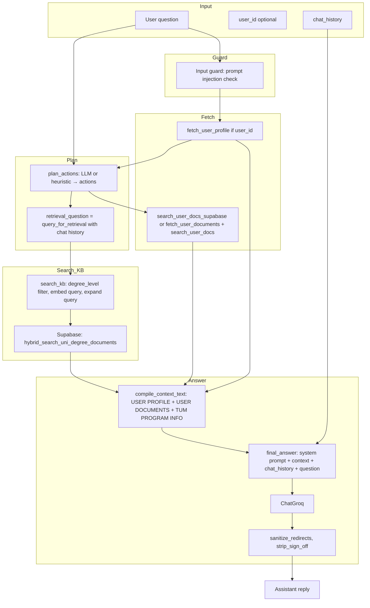
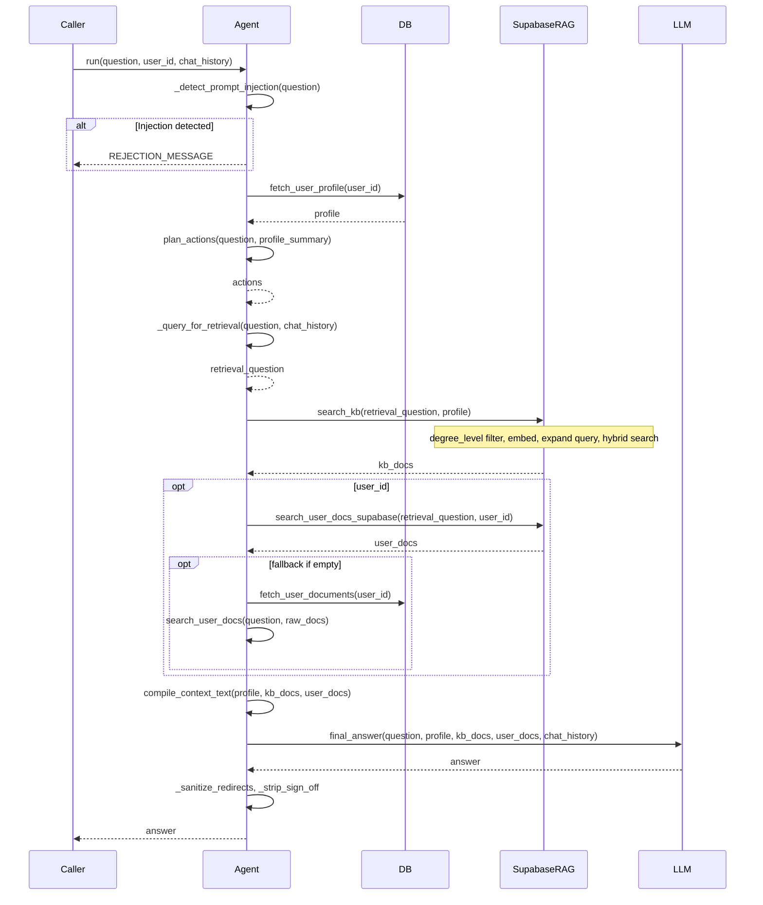
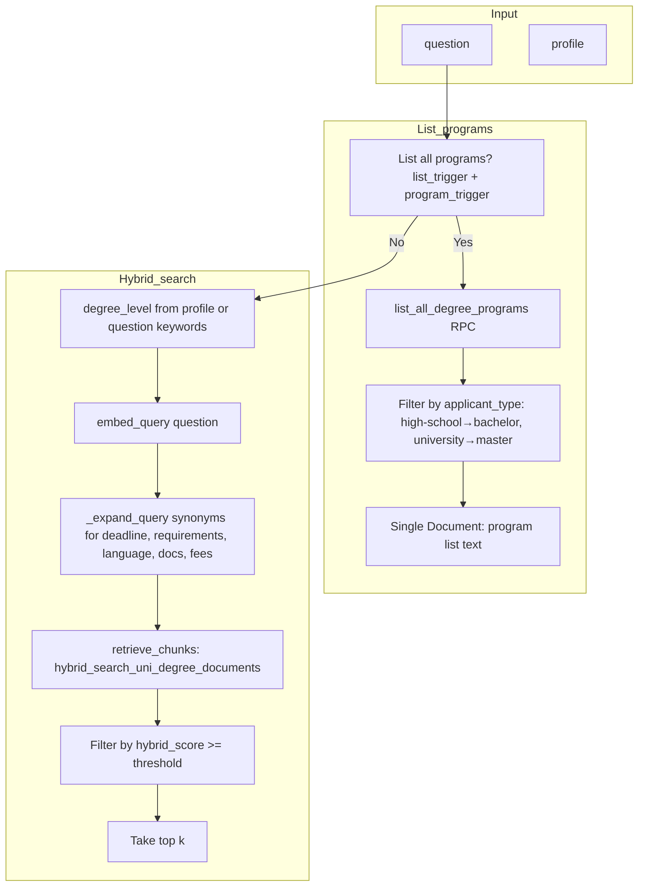
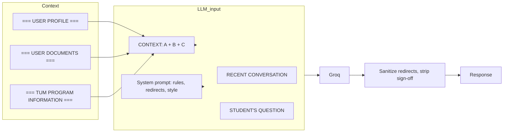
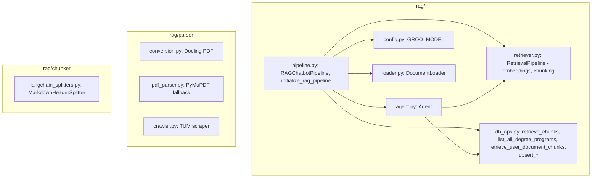

# Teduco RAG Chatbot — Overview & Workflow

**Product presentation reference.**  
RAG (Retrieval-Augmented Generation) chatbot: planning, retrieval (KB + user docs), and answer generation for TUM admissions.

---

## 1. Overview

The RAG chatbot answers user questions using:

1. **TUM program information** — University degree documents stored and searched in Supabase (hybrid semantic + keyword).
2. **User profile** — From Supabase (users, education, preferences); used for eligibility (e.g. Bachelor vs Master) and personalization.
3. **User documents** — Uploaded files (transcript, diploma, CV, etc.) chunked, embedded, and stored in Supabase; searched when the user asks about their own situation.

The **Agent** decides which sources to use, runs retrieval, and the **LLM** (Groq) produces a short, precise answer grounded only in the provided context.

### High-level RAG architecture

```
┌─────────────────────────────────────────────────────────────────────────────┐
│                          RAG CHATBOT                                        │
├─────────────────────────────────────────────────────────────────────────────┤
│  Entry points:                                                               │
│  • POST /chats/{id}/messages  (database-backed chat, user_id from JWT)       │
│  • POST /chat                 (standalone, optional Authorization)            │
├─────────────────────────────────────────────────────────────────────────────┤
│  RAGChatbotPipeline (pipeline.py)                                            │
│  ├── DocumentLoader, RetrievalPipeline (embeddings, chunking config)         │
│  ├── LLM: ChatGroq                                                           │
│  └── Agent (agent.py) ◄── main orchestration                                 │
├─────────────────────────────────────────────────────────────────────────────┤
│  Agent                                                                       │
│  ├── plan_actions(question, profile_summary) → [fetch_profile, fetch_user_   │
│  │   docs, search_kb, search_user_docs, answer]                              │
│  ├── fetch_user_profile(user_id) → Supabase users + education + preferences  │
│  ├── fetch_user_documents(user_id) → download from Storage, parse PDF/text  │
│  ├── search_kb(question, profile) → Supabase hybrid_search_uni_degree_docs  │
│  ├── search_user_docs_supabase(question, user_id) → hybrid_search_user_docs  │
│  ├── compile_context_text(profile, kb_docs, user_docs)                        │
│  └── final_answer(question, profile, kb_docs, user_docs, chat_history) → LLM │
└─────────────────────────────────────────────────────────────────────────────┘
         │                    │                          │
         ▼                    ▼                          ▼
   Supabase (profile)   Supabase (rag_uni_degree_documents,   Supabase (rag_user_documents,
   users, education,   hybrid_search_uni_degree_documents)   hybrid_search_user_documents)
   onboarding_prefs
```

---

## 2. Diagrams for non-technical audiences

*Use these when presenting to stakeholders, product owners, or non-developers.*

### What the assistant uses to answer you

The chat assistant does **not** invent answers. It only uses three kinds of information that Teduco manages for you:

```
┌─────────────────────────────────────────────────────────────────────────────────┐
│  SOURCES THE ASSISTANT USES                                                      │
├─────────────────────────────────────────────────────────────────────────────────┤
│                                                                                  │
│  ① TUM PROGRAM INFORMATION         Official TUM degree info (requirements,       │
│     (always available)             deadlines, application steps).               │
│                                                                                  │
│  ② YOUR PROFILE                    What you entered: high school or university,  │
│     (if you’re logged in)          GPA, target programs, etc.                   │
│                                                                                  │
│  ③ YOUR UPLOADED DOCUMENTS         Transcript, diploma, CV — so the assistant  │
│     (if you uploaded any)           can say what you have or still need.         │
│                                                                                  │
└─────────────────────────────────────────────────────────────────────────────────┘
```

### How your question becomes an answer (simple flow)

```
  YOU ASK                          SYSTEM                                  YOU GET
  ───────                          ──────                                  ───────

  "What do I need                   1. Understands your question
   for Informatics                  2. Looks up TUM program info
   Master?"                         3. If you’re logged in: checks your
       │                               profile and your documents
       │                            4. Writes an answer using ONLY
       │                               that information (no guessing)
       │                                    │
       └───────────────────────────────────┼───────────────────────────────►
                                           │
                                    "For Informatics MSc you need …
                                     Based on your transcript you
                                     already have … You still need …"
```

### Who sees which programs?

So answers stay relevant, the assistant only suggests programs that fit your situation:

```
  IF YOU’RE IN HIGH SCHOOL              IF YOU’RE AT / FINISHED UNIVERSITY
  ─────────────────────────              ─────────────────────────────────
  You see: BACHELOR programs only        You see: MASTER programs
  (e.g. BSc Informatics)                 (e.g. MSc Informatics, MSc Data Science)
  Master’s is for after a first degree   You can also ask about Bachelor’s if you want
```

### When the assistant doesn’t know

The assistant is not allowed to guess. If the answer isn’t in TUM program info or your profile/documents:

```
  Your question                    What happens                         Answer you get
  ─────────────                    ─────────────                         ─────────────
  Something specific               Assistant looks in TUM info          "I don’t have that
  (e.g. a detail not in            and your data — not there            specific information.
  our system)                                                             Please contact
                                                                         study@tum.de for details."
```

---

## 3. Detailed workflow diagrams (technical)

### 3.1 End-to-end: from user message to assistant reply



### 3.2 Agent run sequence (detailed)



### 3.3 Knowledge base search (search_kb) flow



### 3.4 Context compilation and final answer



### 3.5 RAG module file layout



---

## 4. Key behaviors (for presentation)

| Topic | Behavior |
|-------|----------|
| **Planning** | LLM or heuristic chooses: fetch_profile, fetch_user_docs, search_kb, search_user_docs, answer. |
| **Eligibility** | High-school → Bachelor only; university → Master (or Bachelor if asked). Filters KB and program list. |
| **Retrieval** | Hybrid search (semantic + keyword) in Supabase for both university degree docs and user document chunks. |
| **Follow-ups** | `_query_for_retrieval` augments short/follow-up questions with context from recent chat (e.g. program name). |
| **Safety** | Prompt injection guard; only allowed redirects: study@tum.de and TUMonline (no “check TUM website”). |
| **Answer rules** | Only use provided context; no sign-offs; concise; use first name when available. |

---

## 5. Data sources summary

| Source | Table / storage | Used for |
|--------|-------------------|----------|
| User profile | users, high_school_education / university_education, onboarding_preferences | Eligibility, personalization, profile summary in context. |
| TUM programs | rag_uni_degree_documents + hybrid_search_uni_degree_documents | Deadlines, requirements, program info. |
| User documents | Storage bucket + documents table; rag_user_documents (chunks) + hybrid_search_user_documents | CV, transcript, diploma for “my eligibility” type questions. |

---

## 6. Related docs

- **README-BACKEND.md** — How chats and `/chat` call the RAG pipeline and Agent.
- **README-SUPABASE-TABLES.md** — Tables and RPCs used by the RAG chatbot (rag_uni_degree_documents, rag_user_documents, list_unique_degree_programs, hybrid search functions).
