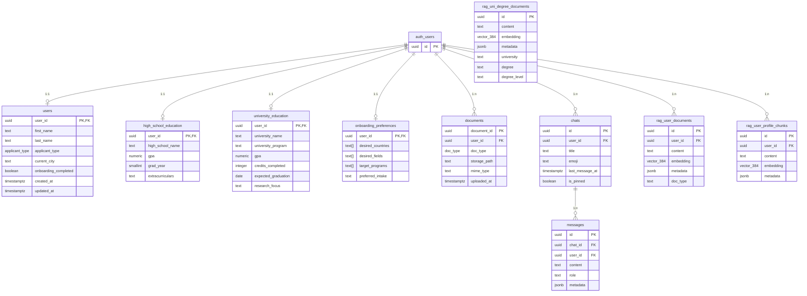
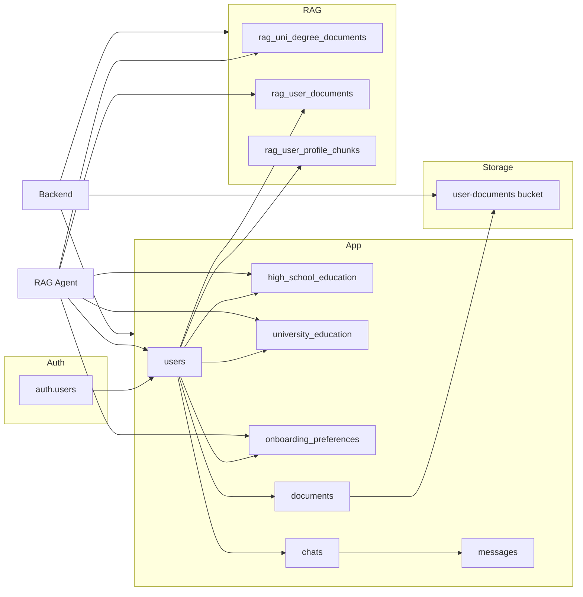

# Teduco Supabase — Tables & Schema

**Product presentation reference.**  
Overview of Supabase PostgreSQL tables, RPCs, and storage used by the app and RAG chatbot.

---

## 1. Overview

Supabase provides:

- **Auth** — `auth.users` (used implicitly; frontend and backend use JWT).
- **PostgreSQL** — Application tables (users, education, preferences, documents, chats, messages) and RAG tables (vector embeddings, hybrid search).
- **Storage** — Bucket `user-documents` for uploaded files (path: `{user_id}/...`).

All application and RAG data access from the backend uses the **service role** or validated **user JWT**; RLS policies enforce per-user access where applicable.

---

## 2. Diagrams for non-technical audiences

*Use these when presenting to stakeholders, product owners, or non-developers.*

### What we store (in plain terms)

All of Teduco’s data is stored in one secure place. Think of it as a set of organized drawers: each type of information has its own place, and only you (or the system on your behalf) can access your own data.

```
┌─────────────────────────────────────────────────────────────────────────────────┐
│  WHAT WE STORE                                                                    │
├─────────────────────────────────────────────────────────────────────────────────┤
│                                                                                   │
│  YOUR ACCOUNT           Who you are (email, name, login).                         │
│  ───────────            Only you and the system can use this.                     │
│                                                                                   │
│  YOUR PROFILE           High school or university, GPA, which programs you’re     │
│  ─────────────          interested in, where you want to study.                    │
│                         Used to personalize answers and show the right programs.  │
│                                                                                   │
│  YOUR DOCUMENTS         Files you upload: transcript, diploma, CV.                 │
│  ──────────────        Stored securely; the assistant uses them only to answer    │
│                         you when you ask about your situation.                    │
│                                                                                   │
│  YOUR CHATS             Every conversation you have with the assistant.           │
│  ───────────            So you can come back later and see the history.          │
│                                                                                   │
│  TUM PROGRAM INFO       Official information about TUM degrees (requirements,    │
│  ───────────────       deadlines). Used to answer everyone’s questions;           │
│                         not tied to one user.                                     │
│                                                                                   │
└─────────────────────────────────────────────────────────────────────────────────┘
```

### How your data is used (one picture)

```
  YOU ENTER / UPLOAD                    WE STORE IT AS                    THE ASSISTANT USES IT
  ─────────────────                    ──────────────                    ─────────────────────

  • Name, school, GPA                  Your profile                      To know if you’re
  • Target programs                                                       high school → Bachelor
  • Preferred country                                                      or university → Master
                                                                          To personalize answers

  • Transcript, diploma, CV            Your documents                    When you ask “what do
  • (PDF files)                        (file + searchable content)          I need?” or “am I eligible?”
                                                                          To compare with requirements

  • Each chat message                  Your chats                        To show conversation
  • Assistant’s replies               (saved per conversation)           history and context
                                                                          for follow-up questions

  (We maintain this                    TUM program information            To answer questions
   from TUM sources)                   (requirements, deadlines)          about programs for everyone
```

### Who can see what

| Data | Who can see or use it |
|------|------------------------|
| Your account (login) | Only you and the system that checks your password |
| Your profile | Only you; the assistant uses it only to answer you |
| Your documents | Only you; the assistant uses them only in your chat |
| Your chats | Only you |
| TUM program info | Used to answer everyone; no one’s personal data is in it |

---

## 3. Table relationship diagram (technical)



---

## 4. Application tables (detailed)

### 4.1 Users and profile

| Table | Purpose |
|-------|--------|
| **users** | 1:1 with `auth.users`. Stores `first_name`, `last_name`, `phone`, `birth_date`, `current_city`, `applicant_type` (enum: high-school, university), `onboarding_completed`, `onboarding_completed_at`, timestamps. |
| **high_school_education** | 1:1 with user. `high_school_name`, `gpa`, `gpa_scale`, `grad_year`, `extracurriculars`, etc. |
| **university_education** | 1:1 with user. `university_name`, `university_program`, `gpa`, `credits_completed`, `expected_graduation`, `research_focus`, etc. |
| **onboarding_preferences** | 1:1 with user. `desired_countries`, `desired_fields`, `target_programs`, `preferred_intake`, `additional_notes`. |

All have RLS: user can only read/update own row. Backend uses service role for full access.

### 4.2 Documents (metadata)

| Table | Purpose |
|-------|--------|
| **documents** | One row per uploaded file. `document_id`, `user_id`, `doc_type` (enum: transcript, language, statement, other), `storage_path` (path in bucket `user-documents`), `mime_type`, `uploaded_at`. |

RLS: own row only. Backend uploads to Storage and inserts here; background job embeds chunks into `rag_user_documents`.

### 4.3 Chats and messages

| Table | Purpose |
|-------|--------|
| **chats** | One row per conversation. `id`, `user_id`, `title`, `emoji`, `created_at`, `updated_at`, `last_message_at`, `is_pinned`, `metadata`. |
| **messages** | One row per message. `id`, `chat_id`, `user_id`, `content`, `role` (user, assistant, system), `created_at`, `metadata`. |

RLS: user can CRUD own chats; user can read/insert own messages. Service role used by backend for AI insert and updates.

---

## 5. RAG tables and functions

### 5.1 University degree RAG

| Object | Type | Purpose |
|-------|------|--------|
| **rag_uni_degree_documents** | Table | Chunks of TUM degree program content. `id`, `content`, `embedding` (vector(384)), `metadata` (source, section, degree, degree_level, etc.), generated columns `university`, `degree`, `degree_level`. |
| **hybrid_search_uni_degree_documents** | Function | Hybrid search: semantic (cosine on `embedding`) + keyword (ts_rank on `content`). Parameters: `query_embedding`, `query_text`, `match_count`, `semantic_weight`, `keyword_weight`, optional `filter_degree_level` (and university/degree). Returns: `id`, `content`, `metadata`, `similarity`, `keyword_rank`, `hybrid_score`. |
| **list_unique_degree_programs** | Function | Returns distinct `degree`, `degree_level`, `source` from `rag_uni_degree_documents` for program listing/filtering. |

Used by the RAG Agent for **search_kb** and for “list all programs” style queries.

### 5.2 User documents RAG

| Object | Type | Purpose |
|-------|------|--------|
| **rag_user_documents** | Table | Chunks of user-uploaded documents. `id`, `user_id`, `content`, `embedding` (vector(384)), `metadata`, `doc_type`, `created_at`. RLS: user can SELECT own; service role full access. |
| **hybrid_search_user_documents** | Function | Same hybrid idea, scoped by `user_id`. Parameters: `p_user_id`, `query_embedding`, `query_text`, `match_count`, `semantic_weight`, `keyword_weight`. Returns same shape plus `doc_type`. |

Used by the RAG Agent for **search_user_docs_supabase**.

### 5.3 User profile RAG

| Object | Type | Purpose |
|-------|------|--------|
| **rag_user_profile_chunks** | Table | Embedded profile summary. `id`, `user_id`, `content`, `embedding`, `metadata`. RLS: user SELECT own; service role full access. |

Populated by backend when profile is updated (background task). Can be used for profile-aware retrieval if needed; currently the Agent fetches profile directly from `users` + education + preferences and does not search this table for answers.

---

## 6. Storage

| Bucket | Purpose | Access |
|--------|--------|--------|
| **user-documents** | User-uploaded files (PDF, etc.). Path pattern: `{user_id}/...` | Authenticated users: CRUD only under own folder. Service role: full access for backend. |

Policies: users can INSERT/SELECT/UPDATE/DELETE only where `(storage.foldername(name))[1] = auth.uid()::text` and `bucket_id = 'user-documents'`. Backend uses service role for uploads and signed URLs.

---

## 7. Workflow: where each table is used



| Flow | Tables / storage |
|------|-------------------|
| Login / JWT | auth.users (via Supabase Auth) |
| Profile CRUD | users, high_school_education, university_education, onboarding_preferences |
| Profile embedding | rag_user_profile_chunks (written by backend) |
| Document upload | documents (row), storage bucket (file), then rag_user_documents (chunks) |
| Chats & messages | chats, messages |
| RAG KB search | rag_uni_degree_documents, hybrid_search_uni_degree_documents, list_unique_degree_programs |
| RAG user-doc search | rag_user_documents, hybrid_search_user_documents |
| RAG profile | users + education + preferences (and optionally rag_user_profile_chunks) |

---

## 8. Summary for presentation

- **Application data**: users, education, preferences, documents (metadata), chats, messages — all keyed by `auth.users.id` (user_id). RLS restricts access to own data; backend uses service role.
- **RAG knowledge base**: `rag_uni_degree_documents` + hybrid search + list_unique_degree_programs for TUM program answers.
- **RAG user data**: `rag_user_documents` + hybrid search for uploaded docs; profile from `users` + education + preferences (and optionally `rag_user_profile_chunks`).
- **Files**: Stored in bucket `user-documents` under `{user_id}/...`; `documents.storage_path` points to object path.

For backend and RAG usage of these objects see **README-BACKEND.md** and **README-RAG-CHATBOT.md**.
